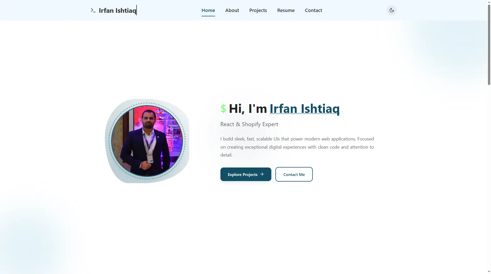
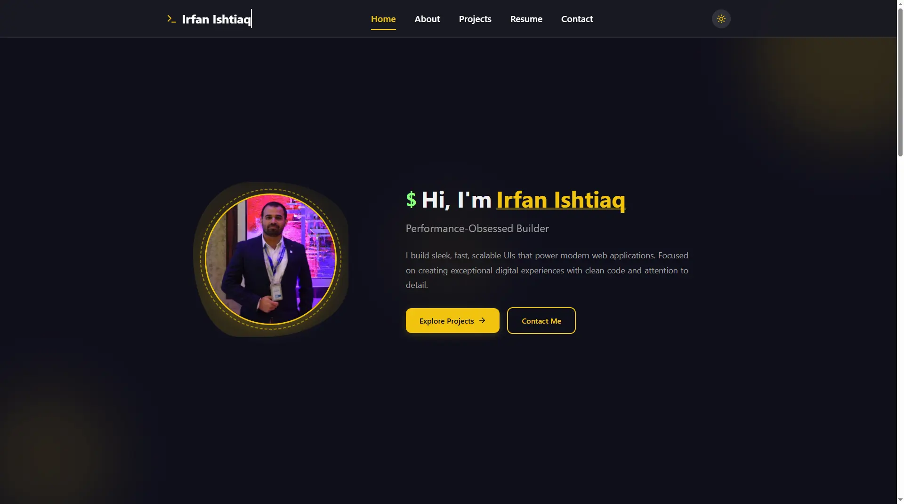
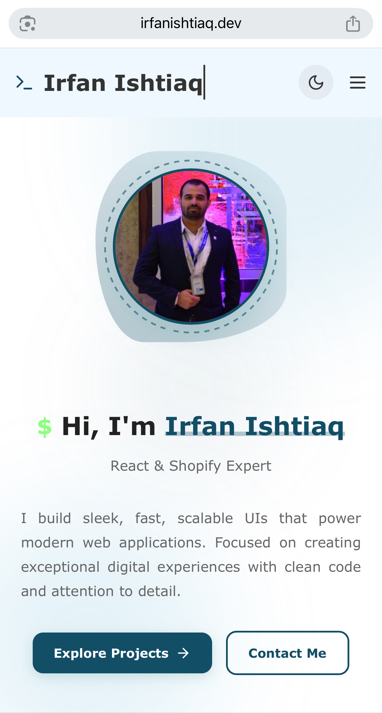

# 🚀 Personal Portfolio - Modern React Application

> **Professional Developer Portfolio** - A sophisticated, interactive portfolio website showcasing modern web development skills through clean design, smooth animations, and exceptional user experience.






## 🌟 Project Overview

A **premium personal portfolio website** that demonstrates mastery of modern frontend technologies and exceptional design sensibilities. This sophisticated React application showcases professional work through an elegant, interactive interface with advanced animations, responsive design, and thoughtful user experience.

Built as the **digital face of my professional brand**, this portfolio combines cutting-edge web technologies with clean, intuitive design to create an engaging platform that effectively communicates technical expertise and creative vision.

## ✨ Key Features

### 🎨 **Premium Design & UX**
- **🌓 Dynamic Theme System** - Elegant light/dark mode with smooth transitions
- **⚡ Advanced Animations** - Framer Motion powered micro-interactions
- **📱 Mobile-First Design** - Pixel-perfect responsive experience
- **🎯 Interactive Elements** - Engaging hover effects and animations
- **✨ Modern Aesthetics** - Clean, professional design language

### 🚀 **Technical Excellence**
- **⚛️ Modern React Architecture** - Hooks, functional components, and best practices
- **🎭 Advanced Animation System** - Framer Motion for smooth transitions
- **📊 Dynamic Content Management** - Organized data structures and components
- **🔧 Component-Based Architecture** - Reusable, maintainable code structure
- **🎨 CSS-in-JS Styling** - Modern styling approaches with CSS modules

### 💼 **Professional Showcase**
- **👤 Interactive About Section** - Comprehensive professional profile
- **💻 Project Portfolio** - Detailed project showcases with live demos
- **📄 Dynamic Resume** - Interactive resume with filtering capabilities
- **📜 Credentials Gallery** - Professional certifications and achievements
- **📞 Contact Integration** - Seamless communication channels

## 🛠️ Technology Stack

### **Frontend Framework**
- **React.js 18** - Modern React with hooks and functional components
- **JavaScript ES6+** - Latest JavaScript features and best practices
- **CSS3 & CSS Modules** - Advanced styling with component-scoped CSS
- **HTML5** - Semantic markup and accessibility features

### **Animation & Interaction**
- **Framer Motion** - Professional animation library for React
- **CSS Animations** - Custom keyframe animations and transitions
- **Intersection Observer API** - Scroll-triggered animations
- **Dynamic State Management** - React hooks for interactive features

### **UI/UX Features**
- **Lucide React Icons** - Modern, consistent iconography
- **Responsive Grid Systems** - Flexible layouts for all devices
- **Theme System** - Dynamic light/dark mode implementation
- **Typography System** - Professional font hierarchy and spacing

## 🌐 Live Website

**🔗 [Visit Portfolio Website](https://www.irfanishtiaq.dev/)**

### **Experience Features:**
- **Interactive Navigation** - Smooth page transitions and routing
- **Project Showcases** - Detailed project presentations with live links
- **Skills Visualization** - Interactive skill categories and filtering
- **Certificate Gallery** - Modal-based credential viewing
- **Responsive Design** - Perfect experience on all devices


## 🎨 Design Philosophy

### **🌈 Visual Design**
- **Minimalist Aesthetic** - Clean, uncluttered interface design
- **Professional Color Palette** - Sophisticated color schemes for both themes
- **Typography Hierarchy** - Clear information architecture
- **Consistent Spacing** - Methodical use of whitespace and padding

### **⚡ Performance Focus**
- **Optimized Assets** - Compressed images and efficient loading
- **Lazy Loading** - Performance-optimized content delivery
- **Smooth Animations** - 60fps animations with GPU acceleration
- **Fast Loading Times** - Optimized bundle sizes and code splitting

### **🎯 User Experience**
- **Intuitive Navigation** - Clear, logical user journey
- **Responsive Interactions** - Immediate feedback for all user actions
- **Accessibility First** - WCAG compliant design patterns
- **Mobile-Optimized** - Touch-friendly interface elements

## 🚀 Getting Started

### **Prerequisites**
- Node.js (v16 or higher)
- npm or yarn package manager

### **Installation & Setup**

1. **Clone the repository**
   ```bash
   git clone https://github.com/irfan3434/portfolio-website.git
   cd portfolio-website
   ```

2. **Install dependencies**
   ```bash
   npm install
   # or
   yarn install
   ```

3. **Start development server**
   ```bash
   npm start
   # or
   yarn start
   ```

4. **Build for production**
   ```bash
   npm run build
   # or
   yarn build
   ```

The application will open at `http://localhost:3000` in development mode.

## 📁 Project Structure

```
portfolio-website/
├── public/
│   ├── index.html
│   └── assets/
├── src/
│   ├── components/
│   │   ├── Home.js          # Hero section with services
│   │   ├── About.js         # About with tab system
│   │   ├── Resume.js        # Dynamic resume section
│   │   └── Projects.js      # Project showcase
│   ├── assets/
│   │   ├── certificates/    # Achievement images
│   │   └── profile/        # Profile images
│   ├── styles/
│   │   ├── Home.css
│   │   ├── About.css
│   │   └── Resume.css
│   └── App.js
├── package.json
└── README.md
```

## 🎯 Advanced Features Deep Dive

### **🎭 Animation System**
```javascript
// Framer Motion implementation
<motion.section 
  initial={{ opacity: 0, y: 30 }}
  animate={{ opacity: 1, y: 0 }}
  transition={{ duration: 0.7, delay: 0.2 }}
>
  {content}
</motion.section>
```

### **🌙 Theme System**
- **Dynamic CSS Variables** - Seamless theme switching
- **Local Storage Persistence** - User preference retention
- **Smooth Transitions** - Animated theme changes
- **Consistent Branding** - Cohesive design across themes

### **📱 Responsive Design**
- **Mobile-First Approach** - Optimized for mobile devices
- **Flexible Grid Systems** - Adaptive layouts for all screen sizes
- **Touch-Friendly Interface** - Mobile-optimized interactions
- **Performance Optimized** - Fast loading on all devices

## 📈 Performance Metrics

### **⚡ Core Web Vitals**
- **Largest Contentful Paint (LCP)** - < 2.5 seconds
- **First Input Delay (FID)** - < 100 milliseconds  
- **Cumulative Layout Shift (CLS)** - < 0.1
- **Google PageSpeed Score** - 90+ on both mobile and desktop

### **🎨 User Experience Metrics**
- **Animation Performance** - Consistent 60fps animations
- **Interactive Elements** - Immediate feedback and response
- **Loading Experience** - Smooth, progressive content loading
- **Cross-Browser Compatibility** - Perfect rendering across all browsers

## 🏆 Business Impact

### **🎯 Professional Branding**
- **Digital Presence** - Strong online professional identity
- **Portfolio Showcase** - Effective project presentation platform
- **Client Acquisition** - Professional platform for business development
- **Career Advancement** - Impressive demonstration of technical skills

### **📊 Technical Demonstration**
- **Modern Development Practices** - Showcases current industry standards
- **Problem-Solving Skills** - Complex technical challenges solved elegantly
- **Design Sensibility** - Balance of aesthetics and functionality
- **Attention to Detail** - Pixel-perfect implementation quality

## 🚀 Future Enhancements

- **📝 Blog Integration** - Technical writing and knowledge sharing
- **🎨 Advanced Animations** - More complex interaction patterns
- **📊 Analytics Dashboard** - Visitor insights and engagement metrics
- **🌐 Multi-language Support** - Internationalization capabilities
- **🤖 AI Integration** - Smart content recommendations
- **📱 PWA Features** - Offline functionality and app-like experience

## 🎯 Why This Portfolio Stands Out

### **💡 Technical Excellence**
- **Modern Architecture** - Latest React patterns and best practices
- **Performance Optimization** - Fast, efficient, and scalable
- **Code Quality** - Clean, maintainable, and well-documented code
- **User Experience** - Intuitive, engaging, and professional interface

### **🎨 Design Excellence**  
- **Visual Impact** - Memorable and professional aesthetic
- **Interaction Design** - Thoughtful micro-interactions and animations
- **Responsive Excellence** - Perfect experience across all devices
- **Brand Consistency** - Cohesive professional identity

## 👨‍💻 Author

**Irfan Ishtiaq** - Senior Frontend Developer & UI/UX Designer

- 🌐 **GitHub:** [@irfan3434](https://github.com/irfan3434/)
- 💼 **LinkedIn:** [Connect with me](https://www.linkedin.com/in/irfanishtiaqdev/)
- 📧 **Email:** irfanishtiaq2k10@gmail.com
- 🌍 **Portfolio:** [View my work](https://www.irfanishtiaq.dev/)

## 📄 License

This portfolio website is a personal project. Design and code are original works by Irfan Ishtiaq.

---

## 🌟 Portfolio Excellence Showcase

### **💼 What This Portfolio Demonstrates**

- **🎨 Advanced UI/UX Skills** - Professional-grade design and user experience
- **⚛️ Modern React Mastery** - Latest React patterns and best practices  
- **🎭 Animation Expertise** - Sophisticated motion design and interactions
- **📱 Responsive Excellence** - Perfect cross-device compatibility
- **🔧 Technical Proficiency** - Clean code architecture and performance optimization
- **🎯 Professional Branding** - Strong digital presence and personal brand
- **💡 Creative Problem Solving** - Innovative approaches to common challenges

---

### 🏆 **Ready to build something amazing together?** 
Visit my **[portfolio website](https://www.irfanishtiaq.dev/)** and let's discuss your next project!

---

*Crafted with 💻 passion and ✨ attention to detail for professional excellence*